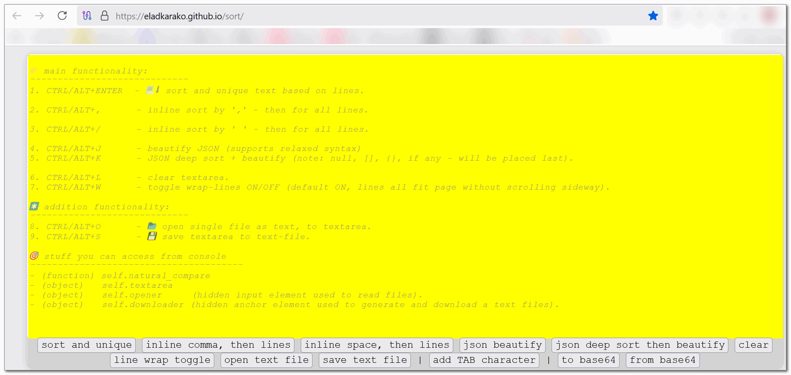

```txt
(ﾉ◕ヮ◕)ﾉ*:･ﾟ✧
```

<hr/>

a html page, with few text-base toolkits,  
most are based on natural sort.  

- text "editor" capable of UTF-8 (textarea with spellcheck ON)
- page with dual functionality key-press or button (accessible via tab).  
- sort lines based content (ctrl+enter or alt+enter - at least one shortcut should work).  
- first step is to sort the line by breaking it to segments based on ',' character as a delimiter, after assembling the line back (using ',' as delimiter).  ctrl or alt with ,  
- same as above, but with space character. ctrl or alt and forward slash.  
- beautify json. it uses json5 to first parse the string from the textarea, which is not that strict as normal JSON parser. then it stringify it back, but this time it uses normal JSON parser.  it means it also "fixes" a JSON into well formatted JSON string. ctrl or alt with 'j'.  
- walk through the objects and arrays and sort everything, as deep as possible. it means arrays will not preserve their order. it also re-order (rebuild) object keys in sorted manner. the result is only useful if you don't care about the order of entries, and very useful for side by side compare of content. ctrl or alt and 'k'.  
- clear all the text area. similar to shortcut of the browser console. ctrl or alt and L.  
- toggle visual line break, it does not change the content. ctrl or alt and w.

notes:  
- the textarea that holds the content is capable of opening and saving its content from to files. ctrl or alt and o to open, ctrl or alt and s to save.  
- all read and write action to and from the textarea elements are done via old execute command instead of directly accessing textarea value attribute. this way you can always have ctrl and z, as UNDO.  

additional notes (developers):  
the natural sort algorithm can use 'self.natural_compare.extractor' which will activate on any pair of elements the `.sort(natural_compare)` will run on.  
normally it is set to `undefined` but you can use the browser console, and write something like:  
`self.natural_compare.extractor = (s)=>(s.replace(/^[^\:]+\:\/\//i,""));` to for example remove all protocol prefix from a list of urls, so that the sorting will be more effective.

<hr/>


<br/>

<hr/>

here is an example for a JSON that is not properly includes `""` around one of its keys, but is perfectly fine to be parsed with `JSON5`  

```json
{c:[99,10,1,300,20,2],"a":{"b":1,"d":11}}
```

beautified (note the stringifier adding `""` around `c`):  

```json
{
  "c": [
    99
   ,10
   ,1
   ,300
   ,20
   ,2
  ]
 ,"a": {
    "b": 1
   ,"d": 11
  }
}
```

deep sort and beautify, note the array order changed.  

```json
{
  "a": {
    "b": 1
   ,"d": 11
  }
 ,"c": [
    1
   ,2
   ,10
   ,20
   ,99
   ,300
  ]
}
```

<hr/>

JSON5  

the human readable as well as the minified version that is included in `index.js` is included in the project, for security measures.  

<hr/>

base64.  

the page uses a little trick to locally encode and decode base64 very fast,  
a pre-calculated table, see code.. it is also uses bytes array when ever possible,  
and it encodes and decodes UTF-8 strings into binary string (all characters values are below 256) without using escape or encodeUriComponent.

<hr/>

note.  

the textarea element is not really optimal container for a lot of text.  
a `DIV` with attribute `contentEditable="true"` is a lot better in handling large amount of text.  
that's because "web" content is rendered more efficiently by the browser.  
i just need to see if there are any down-sides first...  


